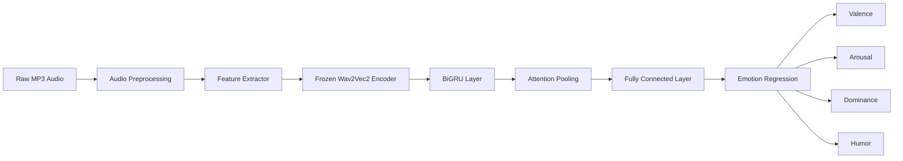
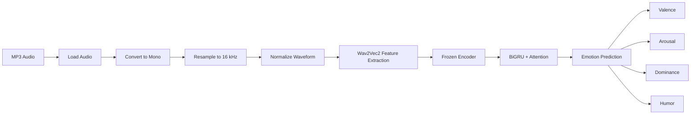

# 🎙️ Audio Emotion Recognition using Wav2Vec2


A lightweight **Speech Emotion Regression** system that predicts **continuous emotional attributes** directly from raw speech using a **frozen Wav2Vec2 encoder** and a **BiGRU + Attention** regression head.

Instead of classifying speech into discrete emotions (e.g., *happy* or *sad*), the model estimates four continuous emotional dimensions:

- ❤️ **Valence** (Negative ↔ Positive)
- ⚡ **Arousal** (Calm ↔ Excited)
- 👑 **Dominance** (Submissive ↔ Dominant)
- 🎭 **Seriousness ↔ Humorous**

The project demonstrates that high-quality emotion regression can be achieved by training only a lightweight prediction head while leveraging rich self-supervised speech representations from Wav2Vec2.

---

# ✨ Key Features

- 🎤 Continuous emotion regression from raw audio
- 🧠 Pretrained **facebook/wav2vec2-base-960h** speech encoder
- 🔒 Frozen encoder for computational efficiency
- 🔄 BiGRU temporal modeling with attention pooling
- 📈 Predicts four emotional dimensions simultaneously
- 📊 Evaluated using **MAE**, **MSE**, and **Concordance Correlation Coefficient (CCC)**
- 🚀 Google Colab compatible
- 🎧 Supports inference on custom MP3 files

---

# 🏗️ Model Architecture



The pretrained **Wav2Vec2 encoder** extracts high-level speech representations from raw audio. Instead of fine-tuning the entire transformer, the encoder remains frozen while a lightweight **Bidirectional GRU** with an **attention pooling mechanism** learns temporal emotional patterns. The pooled representation is then mapped to four continuous emotional attributes through a fully connected regression layer.

---

# 🔄 Project Pipeline



---

# 💡 Why Wav2Vec2?

Traditional speech emotion recognition systems often rely on handcrafted acoustic features such as MFCCs, pitch, and energy. In contrast, **Wav2Vec2** learns rich contextual speech representations through self-supervised pretraining on large-scale speech corpora.

This project leverages these pretrained representations while freezing the encoder, resulting in:

- **Lower computational cost** compared to full transformer fine-tuning.
- **Reduced risk of overfitting** on limited emotion datasets.
- **Faster experimentation and training.**
- **Strong predictive performance** using only a lightweight regression head.

The resulting architecture provides an effective balance between efficiency and accuracy, making it suitable for research, experimentation, and deployment in resource-constrained environments.
---

# 📊 Dataset

This project uses a curated subset of the **LAION Emilia Emotion Dataset**, which contains paired **MP3 audio files** and **JSON annotations** describing continuous emotional attributes.

Each audio sample is annotated with four regression targets:

| Attribute | Original Range | Description |
|-----------|---------------:|-------------|
| ❤️ Valence | -3 → 3 | Negative ↔ Positive emotion |
| ⚡ Arousal | 0 → 4 | Calm ↔ Excited |
| 👑 Dominance | -3 → 3 | Submissive ↔ Dominant |
| 🎭 Seriousness vs Humorous | 0 → 4 | Serious ↔ Humorous |

### Dataset Statistics

| Metric | Value |
|---------|------:|
| Total Audio Samples | **6,389** |
| Training Samples | **5,751** |
| Validation Samples | **638** |
| Audio Format | MP3 |
| Annotation Format | JSON |

To improve training stability, all target values are **normalized to the range [0,1]** during training and mapped back to their original scales during inference.

---

# 📂 Repository Structure

```text
Audio-emotion-recognition/
│
├── Audio_Emotion_Regression.ipynb      # Main notebook
├── Small_sample_data/                  # Sample dataset
├── w2v2_temporal_head/                 # Saved regression head
├── README.md
└── Audio_Emotion_Recognition.pdf       # Research paper
```

---

# ⚙️ Training Configuration

Only the lightweight regression head is optimized while the pretrained Wav2Vec2 encoder remains frozen.

| Parameter | Value |
|-----------|------|
| Speech Encoder | facebook/wav2vec2-base-960h |
| Trainable Layers | BiGRU + Attention + Linear Head |
| Optimizer | AdamW |
| Learning Rate | 1 × 10⁻³ |
| Batch Size | 1 |
| Epochs | 14 (Best Model) |
| Loss Function | Mean Squared Error (MSE) |
| Mixed Precision | Supported |

This design significantly reduces memory usage and training time while preserving the benefits of self-supervised speech representations.

---

# 🚀 Quick Start

## 1. Clone the Repository

```bash
git clone https://github.com/<your-username>/Audio-emotion-recognition.git
cd Audio-emotion-recognition
```

---

## 2. Install Dependencies

```bash
pip install torch
pip install torchaudio
pip install transformers
pip install datasets
pip install accelerate
pip install matplotlib
pip install numpy
pip install scipy
```

or

```bash
pip install torch torchaudio transformers datasets accelerate matplotlib numpy scipy
```

---

## 3. Open the Notebook

The project is designed to run on **Google Colab** with GPU acceleration.

Open:

```
Audio_Emotion_Regression.ipynb
```

Select

```
Runtime
    ↓
Change Runtime Type
    ↓
Python 3 + T4 GPU
```

Google Colab provides sufficient free GPU resources for running this project.

---

# 📁 Preparing the Dataset

The notebook supports **two methods** for loading data.

## Option 1 (Recommended)

Mount Google Drive and place the dataset inside

```text
MyDrive/
└── Colab_Drive_Files/
```

This is the recommended workflow because cached features remain available between sessions.

---

## Option 2

Upload the dataset directly into the Colab workspace.

```text
/content/
└── Data/
```

If using this approach, change

```python
DRIVE_MOUNTED = False
```

inside the notebook.

> **Note:** Files uploaded directly to Colab are lost whenever the runtime is restarted.

---

# ▶️ Running Training

Once the dataset is prepared:

1. Open the notebook.
2. Mount Google Drive (recommended).
3. Run all notebook cells sequentially.
4. Training will begin automatically.
5. The notebook reports training and validation loss after each epoch.
6. The best-performing regression head can be saved for later inference.

Training was performed for **14 epochs**, where stable convergence was observed.

---

# 🎧 Running Inference on Your Own Audio

After loading the trained regression head, simply replace the audio path:

```python
result = predict_attributes(
    "/content/drive/MyDrive/example.mp3"
)
```

The model predicts four continuous emotional attributes:

```text
Valence                :  1.74
Arousal                :  2.88
Dominance              :  0.91
Seriousness/Humorous   :  3.12
```

These predictions are automatically converted back to the **original dataset ranges**, making them directly interpretable.

---

# 💾 Saved Model

The repository includes a pretrained regression head:

```text
w2v2_temporal_head/
```

This allows users to:

- Skip training
- Load pretrained weights
- Evaluate the model immediately
- Predict emotions for custom audio files

This significantly reduces setup time for users who simply want to explore the model.
---

# 📈 Results

The proposed architecture demonstrates that a **frozen Wav2Vec2 encoder** combined with a lightweight **BiGRU + Attention** regression head can effectively predict continuous emotional attributes directly from raw speech while requiring only a small fraction of the trainable parameters compared to end-to-end transformer fine-tuning.

The model converged after **14 training epochs**, achieving stable validation performance across all four emotion dimensions.

---

# 🏆 Performance Summary

| Metric | Value |
|---------|-------|
| Dataset | LAION Emilia |
| Total Samples | **6,389** |
| Training Samples | **5,751** |
| Validation Samples | **638** |
| Best Epoch | **14** |
| Final Validation MSE | **0.0056** |
| Average MAE | **0.0477** |
| Average CCC | **0.5829** |

---

# 📊 Emotion-wise Performance

The model was evaluated using three complementary regression metrics:

- **MAE (Mean Absolute Error)** – Measures the average prediction error.
- **MSE (Mean Squared Error)** – Penalizes larger prediction errors.
- **CCC (Concordance Correlation Coefficient)** – Measures both correlation and agreement between predictions and ground truth.

| Emotion Attribute | MAE ↓ | MSE ↓ | CCC ↑ |
|-------------------|-------:|-------:|-------:|
| ❤️ Valence | 0.0433 | 0.0052 | 0.3577 |
| ⚡ Arousal | 0.0570 | 0.0062 | **0.7138** |
| 👑 Dominance | **0.0331** | **0.0017** | 0.6086 |
| 🎭 Humor | 0.0572 | 0.0055 | 0.6513 |
| **Macro Average** | **0.0477** | **0.0047** | **0.5829** |

---

# 📉 Training Performance

Validation error steadily decreased throughout training before stabilizing around epoch 14.

| Epoch | Validation MSE |
|-------:|---------------:|
| 5 | 0.0070 |
| 10 | 0.0061 |
| **14** | **0.0056** |

This consistent reduction in validation error indicates stable convergence of the regression head without requiring end-to-end fine-tuning of the pretrained speech encoder.

---


# 🎧 Example Emotion Prediction

After training, the model predicts four continuous emotional dimensions for unseen speech samples.

```text
Input Audio:
example_speech.mp3

Predicted Emotion Scores

❤️ Valence                 :  1.74
⚡ Arousal                 :  2.88
👑 Dominance               :  0.91
🎭 Seriousness ↔ Humor     :  3.12
```

> Replace the above example with a prediction generated from your trained model if desired.

---

# 📈 Distribution Analysis

One of the key observations from the experiments is that the predicted mean values closely follow the true validation distribution, while the predicted variance is slightly lower.

| Statistic | Valence | Arousal | Dominance | Humor |
|-----------|---------:|---------:|----------:|-------:|
| Validation Mean | 0.5247 | 0.3107 | 0.5295 | 0.2017 |
| Predicted Mean | 0.5185 | 0.3211 | 0.5334 | 0.1963 |
| Validation Std | 0.0778 | 0.1108 | 0.0479 | 0.0836 |
| Predicted Std | 0.0503 | 0.0834 | 0.0302 | 0.0688 |

This indicates that the model captures the overall emotional distribution effectively while producing slightly more conservative predictions around the mean.

---

# 🔍 Key Findings

### ✅ Efficient Learning

Only the lightweight regression head is trained, while the large Wav2Vec2 encoder remains frozen, significantly reducing computational requirements.

---

### ✅ Strong Temporal Modeling

The Bidirectional GRU effectively captures temporal speech dynamics, while the attention mechanism learns to emphasize emotionally relevant segments of each utterance.

---

### ✅ Best Performing Attribute

**Arousal** achieved the highest agreement with ground-truth labels (**CCC = 0.7138**), suggesting that energetic characteristics of speech are well represented by pretrained Wav2Vec2 embeddings.

---

### ✅ Lowest Prediction Error

**Dominance** achieved the lowest prediction error (**MSE = 0.0017**), indicating highly accurate regression for this emotional dimension.

---

### ⚠️ Most Challenging Attribute

**Valence** remained the most difficult emotion to predict, achieving the lowest CCC.

Unlike arousal, valence often depends on subtle contextual cues that may not be fully represented by acoustic information alone.

---

# 💬 Discussion

The experimental results demonstrate that pretrained self-supervised speech representations contain rich emotional information that can be leveraged effectively without fine-tuning the underlying transformer.

Although the model exhibits conservative predictions with reduced variance, it consistently achieves low prediction error across all emotion dimensions while maintaining good agreement with the ground-truth annotations.

Overall, the proposed architecture provides an excellent balance between **computational efficiency**, **model simplicity**, and **predictive performance**, making it suitable for both research applications and resource-constrained deployment.

---

# 💻 Technologies Used

| Category | Technologies |
|-----------|--------------|
| **Programming Language** | Python |
| **Deep Learning Framework** | PyTorch |
| **Speech Representation Model** | Hugging Face Wav2Vec2 (`facebook/wav2vec2-base-960h`) |
| **Audio Processing** | Torchaudio |
| **Sequence Modeling** | Bidirectional GRU |
| **Attention Mechanism** | Attention Pooling |
| **Optimization** | AdamW |
| **Evaluation Metrics** | MAE, MSE, CCC |
| **Development Environment** | Google Colab |
| **Dataset** | LAION Emilia Emotion Dataset |

---

# 🌍 Potential Applications

The proposed framework can be applied across a wide range of speech understanding and affective computing tasks, including:

- 🤖 Intelligent Voice Assistants
- ☎️ Call Center & Customer Sentiment Analytics
- 🧠 Mental Health and Wellness Monitoring
- 💬 Conversational AI & Chatbots
- 🎓 Online Learning & Student Engagement Analysis
- 🎮 Emotion-Aware Virtual Characters
- 📞 Human–Computer Interaction
- 📊 Speech Analytics Platforms

Its lightweight architecture also makes it suitable for deployment in resource-constrained environments.

---

# 🚀 Future Improvements

Several extensions could further improve the model's performance and applicability.

### Model Improvements

- Fine-tune selected Wav2Vec2 transformer layers.
- Replace the BiGRU with Transformer-based temporal modeling.
- Explore larger pretrained speech models such as HuBERT or XLS-R.
- Investigate parameter-efficient fine-tuning methods (LoRA, Adapters).

### Data Improvements

- Train on the complete LAION Emilia dataset.
- Incorporate multilingual speech datasets.
- Apply additional audio augmentation techniques.
- Improve label balancing across emotion dimensions.

### Deployment

Potential deployment targets include:

- REST API using FastAPI
- Interactive Gradio Demo
- Streamlit Web Application
- ONNX Runtime for edge deployment
- Real-time streaming emotion recognition

---


# 📄 Project Report

This repository is accompanied by a detailed project report developed as part of the **COMP 5530 – Deep Learning** course at the **University of Massachusetts Lowell**.

The report provides a comprehensive overview of the project, including:

- Background and Motivation
- Related Work
- Methodology
- Model Architecture
- Experimental Setup
- Performance Evaluation
- Analysis
- Conclusions
- Future Work

📄 **Audio_Emotion_Recognition.pdf**

---

# 👥 Authors

**Amirth Raj Puramcheriyil**  
*M.S. Computer Science*  
University of Massachusetts Lowell

**Rafael Pashkov**  
*Department of Computer Science*  
University of Massachusetts Lowell

> **Course Project:** Developed as part of the **COMP 5530 – Deep Learning** course at the University of Massachusetts Lowell.

---

<div align="center">

### ⭐ Thank you for visiting this repository!

Feel free to explore the code, experiment with the model, and read the accompanying project report for additional technical details.

</div>
